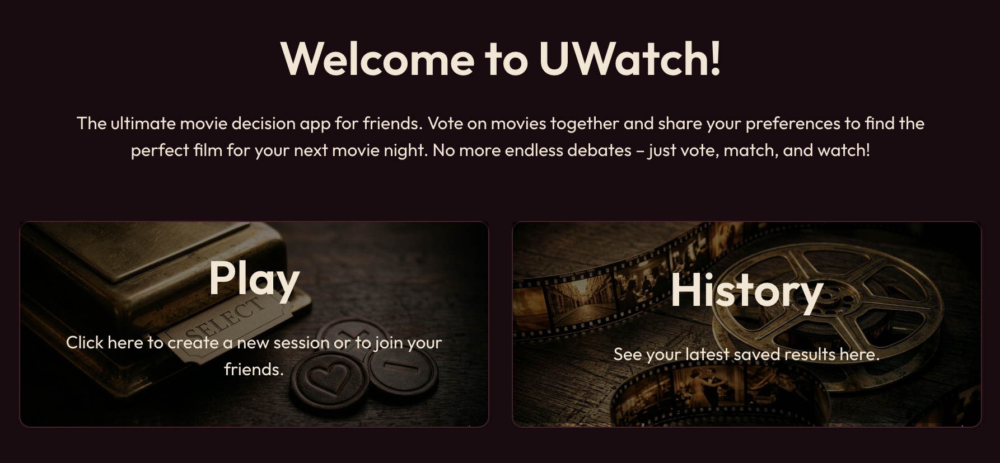
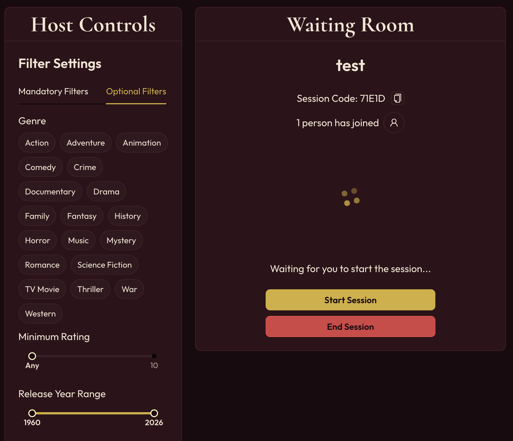
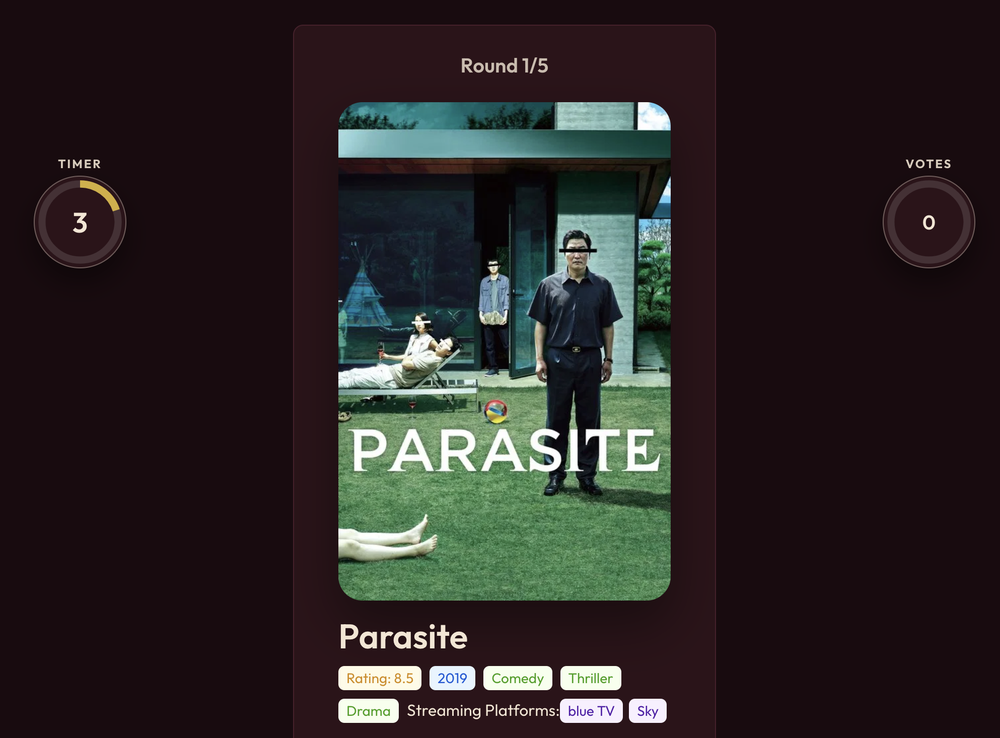

# UWatch - Interactive Movie Finder

This production was conducted during the Software Practical Course at the Department of Informatics at the University of Zurich, during Spring Term 2026. The scope was to build a web-based application that uses at least one external API and features collaborative real-time user experience. The application is called UWatch and is designed to be an interactive movie finder, that can be used by a group of friends in order to find a movie to watch, that suits everybody's taste. The key functionality is to present several movies - based on filters chosen by the host of a session - to the participating users and let them decide whether to like or dislike a respective movie. In the end a final scoreboard for every movie is presented together with additional similar recommendations.

---

## High-Level Components

The frontend is structured into four primary layers to ensure clean separation of concerns and maintainability:

1. **Pages & Routes Layer:** Entry points for user interactions and page-level navigation.
    - _Reference:_ [`app/home/page.tsx`](https://github.com/Yan-Lue/sopra-fs26-group-24-client/blob/main/app/home/page.tsx) - Handles the home page routing, authorization checks, and message display.
    - Coordinates user flows across the application (home, play, login, register, profile, history, session).
    - Manages page-level state and integrates hooks, API calls, and real-time communications.

2. **UI Components Layer:** Reusable, self-contained React components responsible for rendering UI and user interactions.
    - _Reference:_ [`app/components/Navbar.tsx`](https://github.com/Yan-Lue/sopra-fs26-group-24-client/blob/main/app/components/Navbar.tsx) - Navigation bar component with authentication state management and logout functionality.
    - Contains styled, interactive components (Navbar, CurtainIntro) used across multiple pages.
    - Utilizes custom hooks (`useApi`, `useLocalStorage`) for state and API interactions.

3. **Real-time Communication Layer:** WebSocket-based communication for live session updates and collaborative features.
    - _Reference:_ [`app/session/[sessionCode]/page.tsx`](https://github.com/Yan-Lue/sopra-fs26-group-24-client/blob/main/app/session/%5BsessionCode%5D/page.tsx) - Uses `@stomp/stompjs` and `sockjs-client` for WebSocket connections.
    - Enables real-time lobbies, voting updates, and user synchronization across connected participants.
    - Manages subscription to backend channels for session status, user joins/leaves, and movie updates.

4. **Theme & Global Configuration Layer:** Application-wide styling and configuration setup.
    - _Reference:_ [`app/layout.tsx`](https://github.com/Yan-Lue/sopra-fs26-group-24-client/blob/main/app/layout.tsx) - Configures Ant Design's `ConfigProvider` with custom theme tokens, component styling, and colors.
    - Wraps entire app with necessary providers (Ant Design registry, AntdApp component).
    - Ensures consistent styling, typography, and component behavior across all pages.

### Supporting Layers

The above layers are supported by internal utilities and services and part of architectural flow:
- **API Service:** [`app/api/apiService.ts`](https://github.com/Yan-Lue/sopra-fs26-group-24-client/blob/main/app/api/apiService.ts) - Centralizes HTTP communication with the backend, handling requests, responses, errors, and authentication.
- **Custom Hooks:** [`app/hooks/`](https://github.com/Yan-Lue/sopra-fs26-group-24-client/blob/main/app/hooks/) - Provides `useApi()`, `useLocalStorage()`, and other hooks for state management and side effects.
- **Types & Utilities:** [`app/types/`](https://github.com/Yan-Lue/sopra-fs26-group-24-client/blob/main/app/types/) and [`app/utils/`](https://github.com/Yan-Lue/sopra-fs26-group-24-client/blob/main/app/utils/) - Type definitions and helper functions for storage, environment, domain resolution, and UUID generation.

## Getting Started

These instructions will get you a copy of the project up and running on your local machine for development and testing purposes. See deployment for notes on how to deploy the project on a live system.

### Prerequisites

Ensure that one of the following are installed before running the project:

- **Node.js** – [Download here](https://nodejs.org/en/download)
- **Deno** – [Download here](https://deno.com/)

```bash
# Verify your installations
node -v
# or
deno -v
```

### Installing

1. **Clone the repository**

```bash
git clone https://github.com/your-username/sopra-fs26-group-24-client.git
cd sopra-fs26-group-24-client
```

2. **Install dependencies**

```bash
deno install
# or
npm install
```

### Development Mode

1. **Run the development server**

```bash
deno task dev
# or
npm run dev
```

The app will be available at `http://localhost:3000`.

2. **Other available commands**

| Command                             | Description                                 |
| ----------------------------------- | ------------------------------------------- |
| `deno task build` / `npm run build` | Creates an optimized production build       |
| `deno task start` / `npm run start` | Runs the production build locally           |
| `deno task lint` / `npm run lint`   | Checks the codebase for errors and warnings |
| `deno task fmt` / `npm run fmt`     | Formats the codebase uniformly              |

## Deployment

The frontend is hosted on **Vercel**. Deployment is handled automatically via **GitHub Actions** — every push to `main` triggers a new deployment, no manual steps required.

## Built With


## Versioning

We use milestone-based versioning (M1, M2, M3, ...).
For the versions available, see the [tags on this repository](https://github.com/your-username/sopra-fs26-group-24-client/tags).

## Illustrations

In order to get an appropriate overview of the layout and UI of the application, have a look at the following samples:

<p align="center">
  <br>
  <em>The Home Page with Navbar, Session Window and History Window</em>
</p>
<p align="center">
  <br>
  <em>The Host's Waiting Room, including Filter Options for the Session</em>
</p>
<p align="center">
  <br>
  <em>A movie suggestion during a session</em>
</p>

## Roadmap

New features that could be added to contribute to our project: 
- Possibility to watch movie-trailers. Either provided as a link on the results page and/ or by directly embedding in vote-round. 
- Redirect all player to the new round when the host starts a new round. 
- Implement a visually catching alert (e.g. flashing, message..) for the last seconds of each voting.  

## Authors

- **Yannic Lüthi** - _Owner_ - [Yan-Lue](https://github.com/Yan-Lue)
- **Danilo Ruggieri** - _Collaborator_ - [daniloruggieri](https://github.com/daniloruggieri)
- **Noël Schneuwly** - _Collaborator_ - [noelschneuwly](https://github.com/noelschneuwly)
- **Elia Lehmann** - _Collaborator_ - [grootcod](https://github.com/grootcod)
- **Janik Altmann** - _Collaborator_ - [jaltma](https://github.com/jaltma)

## License

This project is licensed under the MIT License - see the [LICENSE.md](LICENSE) file for details.

## Acknowledgments

- Many thanks to all contributors
